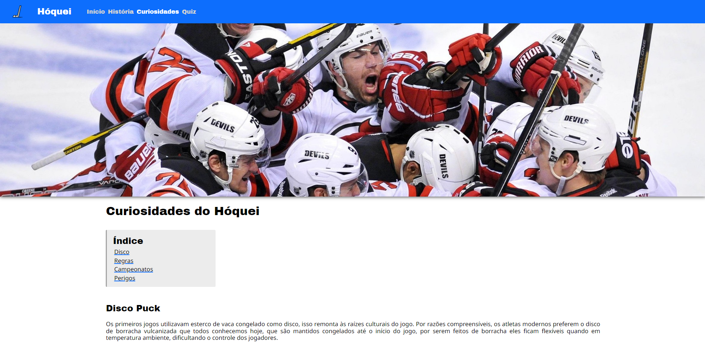
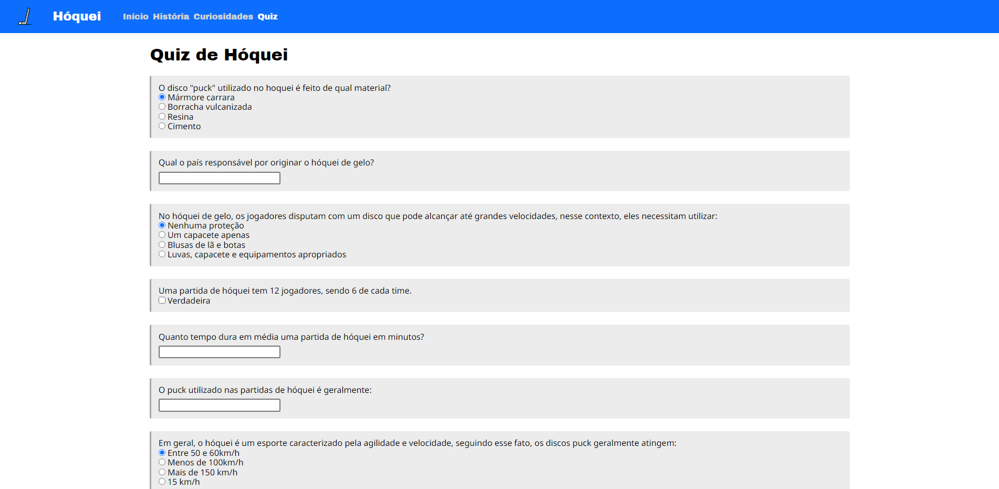

# Site de Hóquei

## Sobre o projeto:

CSS criado inteiramente para o projeto sem uso de frameworks, testado em casos de responsividade para mobile. Quiz em JS que lê e compara respostas entregando porcentagem de acerto, scroll, geração de navbar e footer também feitos em JS puro.
